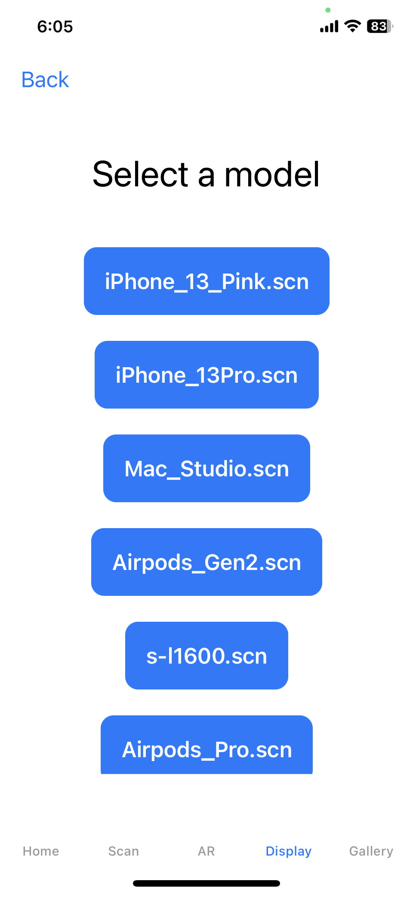

# Getting Started

## Python Dependencies
Run `pip install -r requirements.txt` to install the python packages.

Here are the list of packages:
`
commentjson
imageio
numpy
opencv-python-headless
pybind11
pyquaternion
scipy
rich
tqdm
ninja
torch
scipy
lpips
pandas
trimesh
PyMCubes
torch-ema
dearpygui
packaging
matplotlib
tensorboardX
opencv-python
imageio-ffmpeg
pymeshlab
torch-scatter
xatlas
scikit-learn
torchmetrics
`

## AR Placement
We will use ARKit for AR placement.
# Team Roster

| Team Member       | Contribution     | Challenges and How to Overcome |
| ------------------------ | --------------------- | ------------------------------ |
|Zihao Wei | Develop and deploy the 3D representation generation using instant-ngp on the backend server; Install, deploy and test the docker containers for launching the training process; Figuring out the best parameters for Nerf generation; Develop a light flask backend with upload, download, search, launching, and other API needed; Develop frontend 3d model display function; | **Challenge1**: The first challenge is that Instant-NGP are developed on Debian-based operating systems and our server is a Centos server. Thus many packages required can not be directly installed. **Overcome**: We utilizing the docker container for deploy the Instant-NGP. Docker is always used for deploy apps with complicated dependencies. I wrote a docker-file for directly generating an image with dependencies for Instant-NGP. And using python for docker api to deploy a container for each request on the backstage. The containers are isolated with each other, thus its more stable and will not disturb the main process. **Challenge2**: The Instant-NGP's performance is not such kind of good in the real world. **Overcome**: We find that the default parameters are settled for the synthesis dataset which is not suitable for our real world image. We search a large range of parameters and find the best one. |
| Zixuan Pan |  Scan guidance and suggestion (eg, warning if camera moving too fast); Model generating and downloading frontend interface and frontend-backend connection; 3D model display frontend and local model management; Data collection and interaction with backend. |  |
| Shuyuan Yang | Develop the frontend framework of the app, including framework of each section view, homepage view, tabview, and navigation system. Help with merging Nerf capture scan function into the app framework. Establish the grid item view, retrieve generated model list from backend, and fetch model from backend & display the 3D representation. Work on the entire gif sharing feature and gallery display & search feature.|   **Challenge**: SwiftUI is a new language for me. The first step of developing the app is the hardest, just like everything else. **How to Overcome:** I read through related sections of the Apple Developer Documentation and played with some sample toy projects provided by Apple in order to build the frontend framework of our app.|
| Guanhua Xue |   The first feature I completed is build up logging system and registration system in both front end and backend.The second feature is build up the Django web interface for the gallery function. Although the approach was not adopted in the real implementation, this task required handling the integration of the Django web interface and resolving potential technical challenges. Thirdly,I also provided valuable support for UI/UX design and contributed to implementing UI/UX changes for the app. |  **Challenge**: Integrating the frontend and backend components for user registration and login actions required careful coordination to handle user input, validation, and database interactions effectively.

**How to Overcome** To overcome this challenge, I collaborated closely with both the frontend and backend development teammates especially Zixuan Pan. For example, I asked him technical issues including how to send a post request from front-end to back-end.  In addition, effective communication and regular meetings were held to define API requirements and establish a clear understanding of data formats and structures. By debugging frequently, we identify and address any issues in the interaction between the frontend and backend components. By working together as a team and skills learned from the internet, I successfully achieved the integration of the User Registration and Logging System, ensuring a smooth user experience throughout the registration and login process.|
| Chenhao Zheng |  Mainly takes charge of all the AR related functionalities (showing 3D objects in AR&VR, moving objects with hands, identify contact surface, and place objects, etc.).   Currently, the code is in this repo (https://github.com/hellomuffin/ARfor3D.git) and not integrating into the main branch to avoid dependency conflicts.     |  |
| Yihan Jin |  Develop the 3D model display view of the app and test the availability. Contribute to some backend functionality such as the realization of the search function.   |  |
# **Getting Started**: 

#### Deploy backend:

##### AI-related deployment:

We require the users have NVIDIA GPUs with at least 8G GPU memory and Nvidia CUDA and Toolkit installed.  For reference, our server are installed with 4 NVIDIA A100-80G gpus, with CUDA 12.1 and corresponding cudnn installed.

Nvidia Driver: https://www.nvidia.com/Download/index.aspx?lang=en-us

Nvidia CUDA: https://developer.nvidia.com/cuda-downloads

Nvidia CUDNN Toolkit: https://docs.nvidia.com/cudnn/index.html

We utilizing docker for deploy our AI-related features, especially the Instant-NGP algorithms. Utilizing docker allows us to due as much as request as possible.  Here we provide the instructions for installed the docker and docker API:

Docker: https://docs.docker.com/get-docker/

Docker-compose: https://docs.docker.com/compose/

Nvidia-docker2: https://github.com/NVIDIA/nvidia-docker

Python-on-whales: https://gabrieldemarmiesse.github.io/python-on-whales/

Instant-NGP: https://github.com/NVlabs/instant-ngp

We also provide a test scripts in ``/Backend/Instant``, if the ``python compose_test.py`` can run without error, then the AI part are installed successfully.

##### API-related deployment:

Our backend is deployed using the flask framework, which is a much lighter backend. Our backend can be easily installed by ``pip install -r requirements``,  and to deploy, just run ``python app.py``. 

A reference for how to use flask can be easily found in: https://flask.palletsprojects.com/en/2.3.x/

# Model and Engine

## Story Map

  

| Component                | Description                              | Connection                               |
| ------------------------ | ---------------------------------------- | ---------------------------------------- |
| **Data Acquisition UI**  | Acquire data from various sources including users' phones. | Connect to**3D Generating Models** to transfer data and parameters using views. |
| **3D Generating Models** | Generate 3D models based on the data obtained and parameters users specified. | Connect to **Display UI** for 3D representation of generated models. |
| **Display UI**           | Display the generated 3D models to the user. | Connect to **Other App** to share 3D representation to other platforms and **Gallery** to save 3D representation on the cloud. |
| **Other App**            | Provide additional functionality extended from the app including sharing. | /                                        |
| **Gallery**              | Allow the user to view and manage a collection of 3D models. | Connect to **Other Users** allowing other users to download generated 3D representations. |
| **Other Users**          | Allow other users to interact with the app. | Connect to **Display UI** allowing other users to share models. |

## Block Diagram

### Data Acquisition UI
Use ARKit offered by swift, which contains a rendering function. Then Use camera position and implement camera calibration algorithm to compute intrinsic and extrinsic matrices. Maybe cameraCalibrationData function can be directly applied to photos. Use extrinsic matrices to calculate the world coordinates. Use the world coordinates of cameras and objects, compute missing parts and give a camera movement and rotation suggestion. When the user begin to take the picture, we are able to give a real-time suggestion of whether this pose is appropriate or not by the estimated coordinate and the previous images.

### 3D Generating Models
We utilize the taken image and the Nerf algorithm to train a MLP model, which should contain the 3D information. By querying from different pose, he output will be a Nerf-based MLP parameter, which could be considered as a compressed version of the 3D model. The generated MLP parameter could be generated to other popular 3D representation format, such as the Mesh format, using Nerf2Mesh algorithm.

Ref: Instant Nerf: https://github.com/NVlabs/instant-ngp
Ref: Nerf2Mesh: https://github.com/ashawkey/nerf2mesh

### Display UI
In the first part, we would like to use swift to display the .obj model, which is in the mesh format. We will directly utilizing the Swift's scene-related API. For AR placement, we would like to work on Unity's AR foundation system and export the app as Swift, which could be easily combined with our main UI. An alternative way is to directly export the python model in to Unity.

Ref: Display .obj: https://developer.apple.com/forums/thread/3979
Ref: AR placement: https://github.com/fariazz/ARFoundationPlacementIndicator
Ref: NeRF model to Unity: https://github.com/julienkay/MobileNeRF-Unity-Viewer

### Other App
We utilize system APIs such as iOS APIs to provide additional functionality to the user. One way to share the result with other apps is by using the Web Share API Level 2. This API allows for sharing files, including images, from a web app running in Safari on iOS. 

Ref: iOS Safari Web Share API Level 2: https://developer.apple.com/forums/thread/133310

### Gallery
We use a backend database to allow interaction with users. The backend server will be built using Python and a web framework such as Django. Django provides functionalities for uploading and downloading files through the use of APIs that enable communication between the frontend of the app and the backend database.

Ref: File Uploads: https://docs.djangoproject.com/en/4.2/topics/http/file-uploads/
# APIs and Controller

## User login interface

**Web Authentication API**

WebAuthn uses asymmetric (public-key) cryptography instead of passwords or SMS texts for registering, authenticating, and multi-factor authentication with websites.

**Returns**

| Key        | Location | Type     | Description                              |
| ---------- | -------- | -------- | ---------------------------------------- |
| `timeout`  | JSON     | number   | time used in ms                          |
| `success`  | JSON     | function | function of succeed in login the interface |
| `fail`     | JSON     | function | function of fail to login the interface  |
| `complete` | JSON     | function | function of finish the login process     |

**`object.success` function**

| Location | Type   | Description                              |
| -------- | ------ | ---------------------------------------- |
| code     | string | openid, session key and other login information |

**`object.fail` function**

| Location | Type   | Description   |
| -------- | ------ | ------------- |
| errMsg   | string | error message |
| errno    | number | errno code    |

## File upload and sharing

**Filestack**

**Request Parameters**

| Key             | Location | Type         | Description                    |
| --------------- | -------- | ------------ | ------------------------------ |
| `--data-binary` | string   | @file name   | name of the file for uploading |
| `--header`      | string   | Content-Type | image/png for image uploading  |

**Returns**

| Key        | Location | Type   | Description                     |
| ---------- | -------- | ------ | ------------------------------- |
| `url`      | JSON     | string | location of file being stored   |
| `size`     | JSON     | int    | size of file in KB              |
| `type`     | JSON     | string | same as header in `REQUEST`     |
| `filename` | JSON     | string | name of the file for uploading  |
| `key`      | JSON     | string | file name in the cloud database |

## Frontend Communication with Backend

The frontend communicates with the backend using HTTP methods and RESTful APIs. Here is a list and description of the APIs used in the application:

1. **POST /upload**: This API allows users to upload files to the backend server. It receives the file from the frontend and stores it in the designated upload folder.
2. **GET /launch/<filename>**: This API is used to launch the application with the specified file. It unzips the uploaded file, processes it, and generates the 3D model representation. The results are stored in the output folder.
3. **GET /list_input_dir**: This API returns a list of files available in the input directory.
4. **GET /list_output_dir**: This API returns a list of files available in the output directory.
5. **GET /list_upload_dir**: This API returns a list of files available in the upload directory.
6. **GET /search/<filename>**: This API allows users to search for files in the output directory based on the provided filename. It returns a list of files that match the search criteria.
7. **GET /download/<filename>**: This API allows users to download files from the output directory based on the provided filename.
8. **POST /register**: This API is used for user registration. It receives the user's registration information from the frontend, creates a new user account, and stores it in the database.
9. **POST /login**: This API is used for user login. It receives the user's login credentials from the frontend, verifies the user's credentials, and grants access to the user's account dashboard or main app interface.
10. **GET /logout**: This API allows logged-in users to log out from their account. It terminates the user's session and redirects them to the login page.

The frontend uses these APIs to interact with the backend, enabling seamless user experiences for file upload, 3D model generation, file management, user registration, and login/logout functionalities.

## Interaction with Platform Sub-Systems and 3rd-Party SDKs

The application interacts with platform sub-systems and 3rd-party SDKs in the following ways:

1. **Web Authentication API**: The application uses the Web Authentication API for user registration and login, replacing traditional passwords with public-key cryptography for enhanced security.
2. **Filestack SDK**: The application utilizes the Filestack SDK to handle file upload and sharing functionalities. It sends files to the Filestack cloud for storage and retrieval, and the results are returned to the frontend for display.

By leveraging these platform sub-systems and SDKs, the application enhances its capabilities and ensures efficient handling of user interactions and file management.

# View UI/UX
Our UI/UX is composed of five main parts: Home, Scan, AR, Display and Gallery.
## Final UI/UX Design
### Home 
This is the main screen of the app where you can access all the other sections. It provides an overview of the app’s features and allows you to navigate to different sections.

  

### Scan
This section allows you to scan real-life objects and turn them into 3D models either from online or offline mode. You can use your device’s camera to capture pictures  of the object from different angles following instructions, and the app will generate a 3D model based on these pictures. Below is the flow illustration of Scan part.

**Step1: Choosing Online/Offline Mode**

  

**Step2: Capture Pictures following Instructions and Save Frame**

  

**Step3: Name Your Own Model and Upload Images**

  

  

**Step4: Generate Models**

  

  

**Step5: Download Models**

  

### AR
 This section allows users to place  3D models in an augmented reality environment. Users can use their device’s camera to view the real world and place your 3D models in it, allowing them to see how they would look in a real-life setting.
 

  

### Display
 This section allows users to preview your 3D models in more detail. Users can rotate, zoom, and pan around the model to view it from different angles. Users can also generate new views of the model and save or share them.

**Step1: Select Model**

 

  

**Step2: View Model**

 

  

### Gallery
This section allows users to view and manage their collection of 3D models. Users can search for models by name, view them in more detail, download online models uploaded by other users, and share them with others.

 

  

**Step1: Search a Model**

 

  

**Step2: View/Share Model**

 

  

## Usability Test Results

Our usability tests measured participant success in completing various tasks within a certain time frame or number of clicks. Here are the results:

| Task                                     | Metric              | Participant Result (success samples on average) |
| ---------------------------------------- | ------------------- | ---------------------------------------- |
| Turn a circle to get the first round of video | < 30s               | 10s                                      |
| Move the camera and take another video   | < 45s               | 20s                                      |
| Put their own models in an AR environment | < 1 min             | 20s                                      |
| Rotate their models in an AR environment | < 3 drags           | 2 drags                                  |
| Generate new views with current model    | < 30s for each view | 30s                                      |
| Save the model                           | < 3 clicks          | fail (no button appear)                  |
| Share the model (actually share view)    | < 3 clicks          | 2 clicks                                 |
| Download online models                   | < 1 min             | fail (no button appear)                  |
| Search online for a certain model with names | < 30s               | 15s                                      |
| Search locally for user's own model with names | < 30s               | 15s                                      |
| Display model in gallery                 | < 5 clicks          | 1 click                                  |
## Modifications and Justifications
Based on the findings from the mockup usability tests, we have made the following modifications to our UI/UX design to address the issues and improve the overall user experience:

1. Differentiating Move Camera and Drag Icons: We have changed the icon for dragging the 3D model to a hand icon, which is distinct from the move camera icon. This change ensures users can easily understand the action they need to perform to manipulate the model.
2. Addition of Save Model Button: In the Display section, we have added a prominent "Save Model" button. This allows users to save the 3D model after previewing it in detail. Now, users can easily store the models they like for later use.
3. Inclusion of Download Button in the Gallery: To enable users to download online models uploaded by other users, we have added a clear "Download" button in the gallery section. This button appears next to each online model, making it straightforward for users to access and save models they find interesting.
4. Incorporating Share Model Button: To facilitate easy sharing of 3D models, we have added a "Share" icon directly after the model is generated. This way, users can quickly share their creations without needing to go through the preview process first.
5. Clarity in Section Names: We have modified the label from "Collection" to "Scan" to better represent the process of collecting data to create 3D models. This change helps eliminate confusion between the Scan and Display sections.
6. Refinement of Share View Function: The share button now appears only after a view has been generated. This change ensures that users can only share images after they have been created and are ready for sharing.

**Justifications:**

* Differentiating icons: By using distinct icons for move camera and drag actions, users can easily grasp the intended action, reducing confusion and improving interaction with the app.
* Save and Download buttons: The inclusion of clear and visible buttons for saving and downloading models streamlines the process for users. They can now perform these actions with just a few clicks, enhancing user satisfaction.
* Share model functionality: By adding a share button right after model generation, users can immediately share their creations. This simplifies the sharing process, making it more intuitive and efficient.
* Clear section names: Renaming "Collection" to "Scan" provides a more accurate representation of the section's purpose, reducing ambiguity for users and facilitating smoother navigation.
* Refined share view function: Requiring the generation of a view before the share button appears ensures that users only attempt to share completed and desired images. This avoids unintended sharing of undesired views.

These changes help enhance user satisfaction, minimize confusion, and create a more user-friendly and intuitive app interface for our users.

